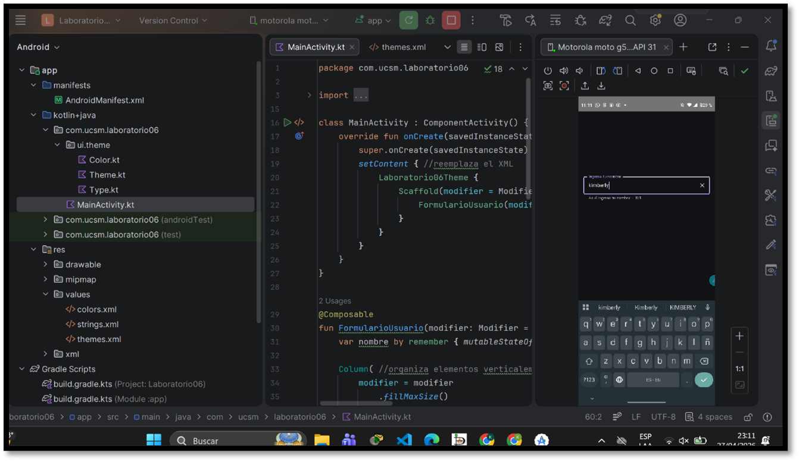
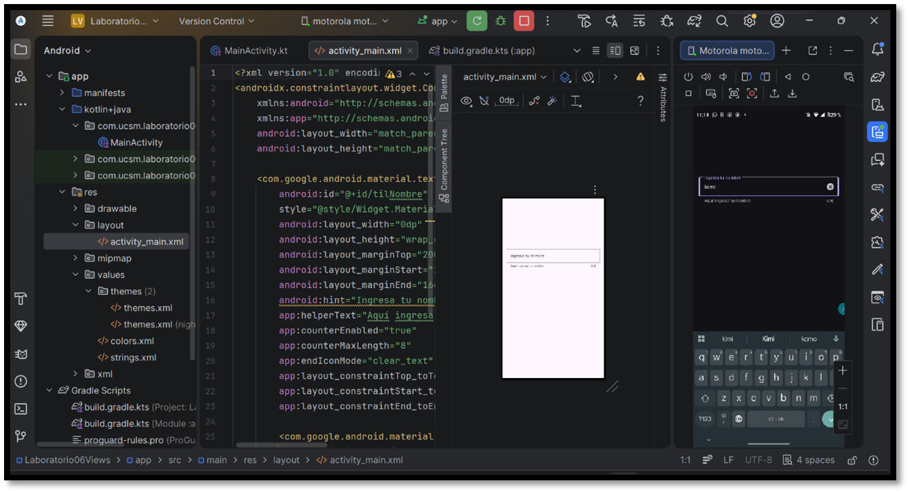
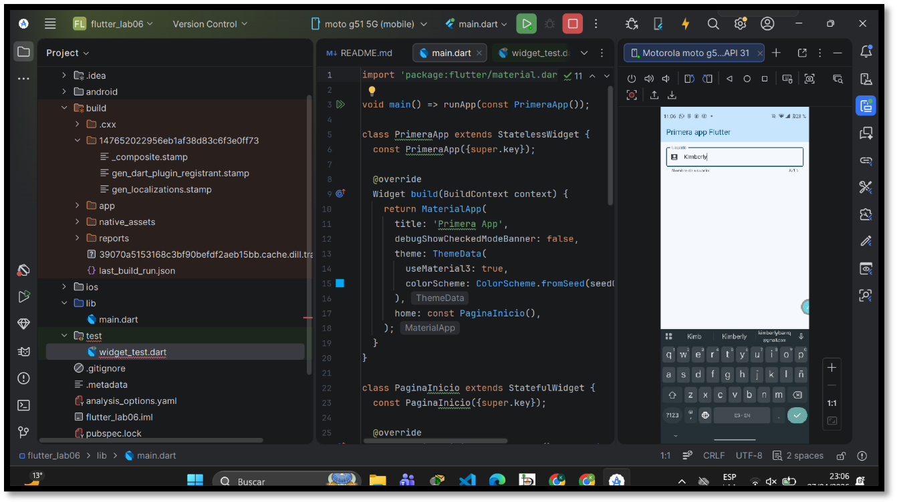
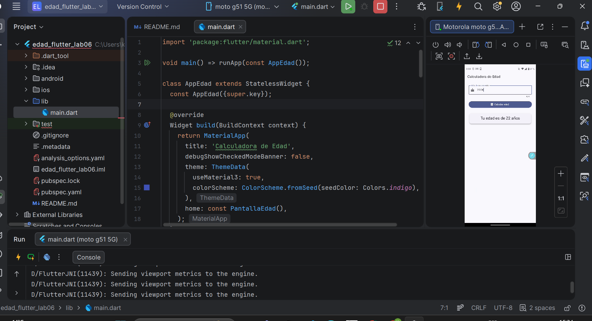
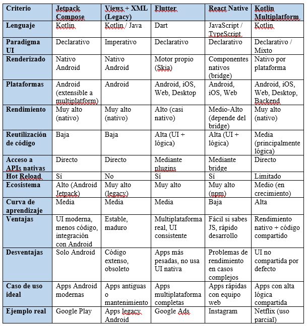

#  Laboratorio 06 - Tecnologías Móviles

##  Descripción general
En este laboratorio se desarrollaron actividades relacionadas con el uso de **Material 3**, **Jetpack Compose**, **Views tradicionales en Android** y **Flutter**, con el objetivo de comparar paradigmas de desarrollo móvil y aplicar conceptos modernos en la creación de interfaces de usuario.

#  PARTE A · Jetpack Compose (Material 3)

Se desarrolló una aplicación en Android utilizando **Jetpack Compose**, implementando un formulario de ingreso de nombre con las siguientes características:

- Uso de `OutlinedTextField`
- Validación de longitud (máximo 8 caracteres)
- Contador de caracteres dinámico
- Ícono de limpieza (Clear)
- Manejo de estado con `remember` y `mutableStateOf`
- Uso de `MaterialTheme` con esquema de colores (Material 3)

 Evidencia:

#  PARTE B · Views + XML (Sistema clásico)

Se implementó el mismo formulario utilizando el enfoque tradicional de Android:

- Layout en XML (`ConstraintLayout`)
- Uso de `TextInputLayout` y `TextInputEditText`
- Contador de caracteres
- Ícono de limpieza (`endIconMode`)
- Estilos de Material 3 en XML

Este enfoque permite comparar el paradigma **imperativo** frente al declarativo de Compose.

 Evidencia:

#  PARTE C · Flutter (Material 3)

Se desarrolló una aplicación en Flutter utilizando:

- `MaterialApp` con `useMaterial3: true`
- `ColorScheme.fromSeed`
- `TextField` con `TextEditingController`
- `AppBar` personalizado
- Buen manejo del ciclo de vida con `dispose()`

Se verificó la correcta instalación mediante `flutter doctor`.

 Evidencia:

---

#  EJERCICIO 1 · Calculadora de edad en Flutter

Se desarrolló una aplicación que permite calcular la edad a partir del año de nacimiento.

###  Características:
- Uso de `StatefulWidget`
- Manejo de estado con `setState()`
- Validación de entrada (1900 - año actual)
- Uso de `errorText` en `InputDecoration`
- Botón `FilledButton` (Material 3)
- Resultado mostrado en un `Card`

 Evidencia:

#  EJERCICIO 2 · Análisis comparativo de frameworks

Se realizó una tabla comparativa entre los siguientes frameworks:

- Jetpack Compose
- Flutter
- React Native
- Kotlin Multiplatform

###  Criterios evaluados:
- Lenguaje
- Paradigma de UI
- Plataformas soportadas
- Modelo de renderizado
- Rendimiento
- Ecosistema
- Curva de aprendizaje
- Ventajas y desventajas

 Evidencia:

# EJERCICIO 3 · Selección de framework

Se realizó una decisión técnica basada en el proyecto:

### Proyecto:
Aplicación tipo marketplace universitario para compra y venta de productos (libros, apuntes, etc.).

### Decisión:
Se eligió **Jetpack Compose** debido a:

- Desarrollo exclusivo en Android
- Mejor rendimiento (nativo)
- Integración directa con Kotlin
- Facilidad para consumir APIs (web services)
- Menor complejidad frente a frameworks multiplataforma

### Frameworks descartados:
- Flutter → innecesario para solo Android  
- React Native → dependencia de bridge  
- Kotlin Multiplatform → complejidad adicional  

---

# Conclusión

Este laboratorio permitió comprender las diferencias entre:

- Paradigma **imperativo vs declarativo**
- Desarrollo **nativo vs multiplataforma**
- Uso de **Material 3 en diferentes tecnologías**

Además, se evidenció que la elección del framework depende del contexto del proyecto, priorizando simplicidad, rendimiento y experiencia del equipo.

---

# Autor
Kimberly Barra Quispe
